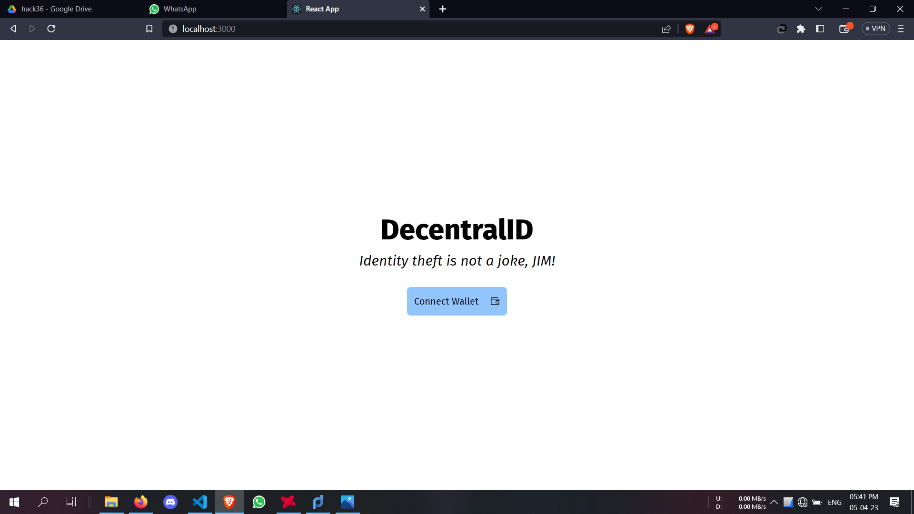
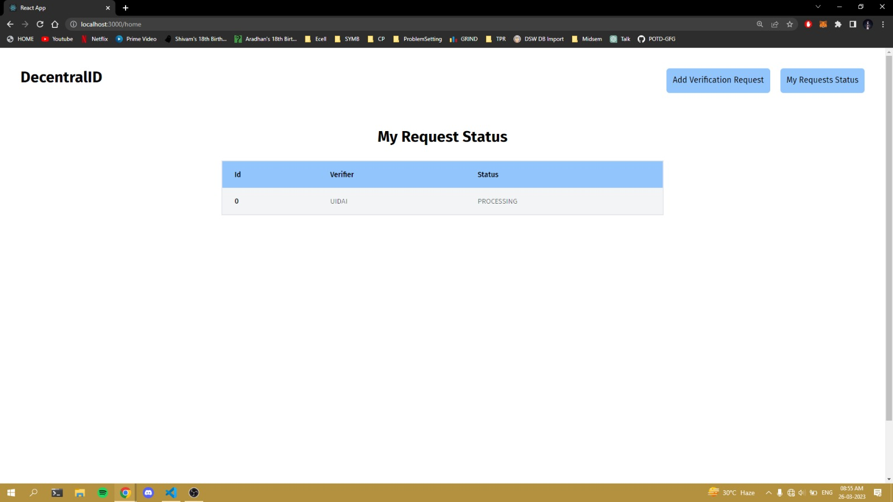
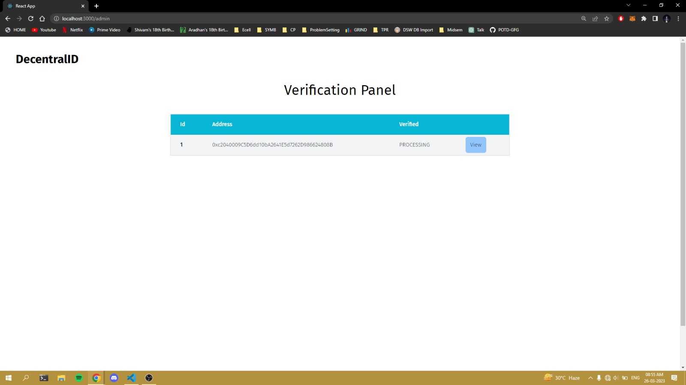

# DecentralID

This project was developed by us, **Team ECMAniacs**, as a submission for [Hack36 6.0](https://www.hack36.com/)

UPDATE - We went on to win 1st position in this hackathon, Hack36 :)

## Resources
- [PPT](https://docs.google.com/presentation/d/1fDOJagdUc-62sfzt8al91WkodRhC2Zv7d_QZ0y-s-NQ/edit?usp=sharing)
- [Video Demo](https://youtu.be/zDhHoVL1Ed8)

## Team ECMAniacs
- [Aqib Suhail](https://github.com/geeqib23)
- [Dennis Thomas](https://github.com/DNA5769)
- [Kushagra Sharma](https://github.com/randomkush)
- [Akash Kandasamy](https://github.com/akash-kd)

---

Through this project, we aim to build a decentralized identity verification service that addresses that addresses the issues of data breach and identity theft.

## Why We Built This
There are many websites and services out there which require us to submit our official documents online to them for purposes such as ID Verification, Age Verification and so on.
Just to prove their identity, users are forced to give away their personal documents which contain a lot more personal data than the user may want to share. Also, there are great chances of the user data being compromised due to data breaches and data theft. This leads to problems of privacy, security, and trust.

## Technologies Used and Working

1. Smart Contracts - We wrote our smart contracts in Solidity. We used Hardhat to run them on a development network and test them and finally deployed them on the Blockchain. We use these contracts to make implement logic and store data through ETH transactions.
2. Frontend - We used ReactJS for UI and TailwindCSS for styling.
3. Backend - We used ExpressJS to create the server and listen to requests from client. MongoDB Atlas as our database for storing information about the user’s hashes and their trust scores. We’ll also manually store the hashes of the wallets of the verifiers which will get access to the document uploaded by the user.
4. Metamask - MetaMask is a software cryptocurrency wallet used to interact with the Ethereum blockchain. We used its browser extension to access the Ethereum wallet and interact with our application.
5. IPFS - IPFS or InterPlanetary File System, is a peer-to-peer distributed file system that allows users to store and access files in a decentralized manner. Instead of relying on a central server, IPFS uses a distributed network of nodes to store and share files. We used IPFS to store user’s documents so the verifier can access them later and check whether it’s authentic or not. Only the user and the verifier of the document can access the document from IPFS.

## Demo

## Challenges We Faced
1. Learning Solidity and IPFS : All of us were not too much familiar with solidity and we've learned it on the go as we made this project.
2. Coming up with secure and efficient smart contracs. 
3. Identity Crisis
